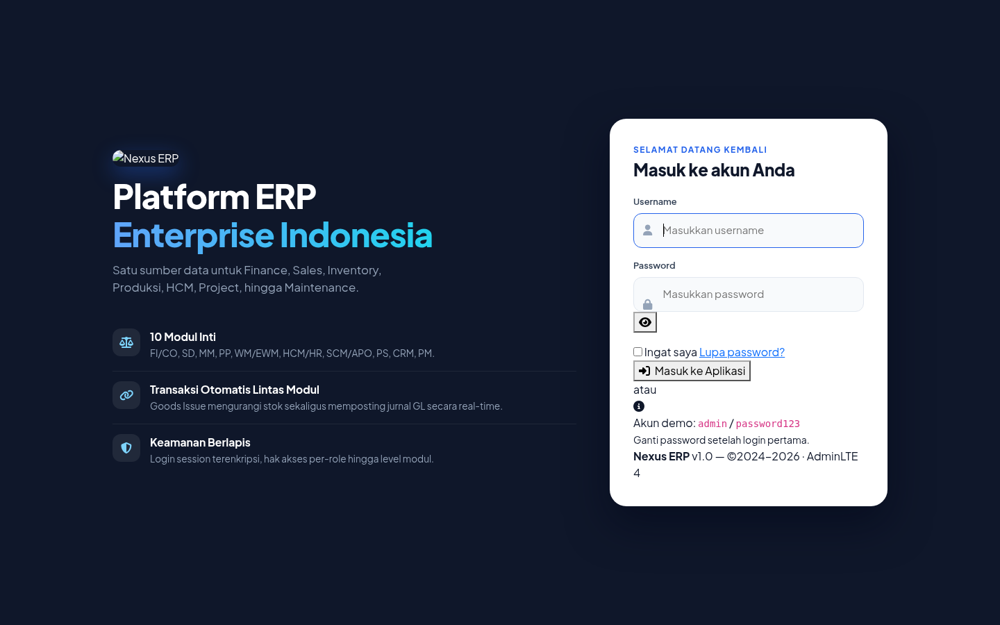
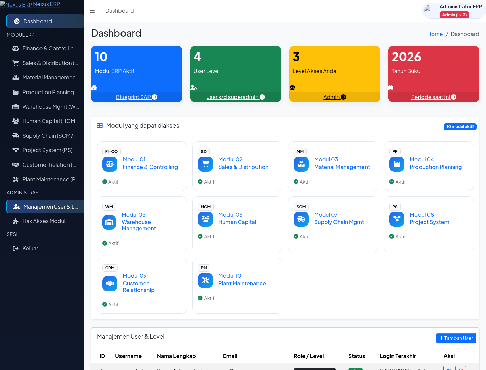
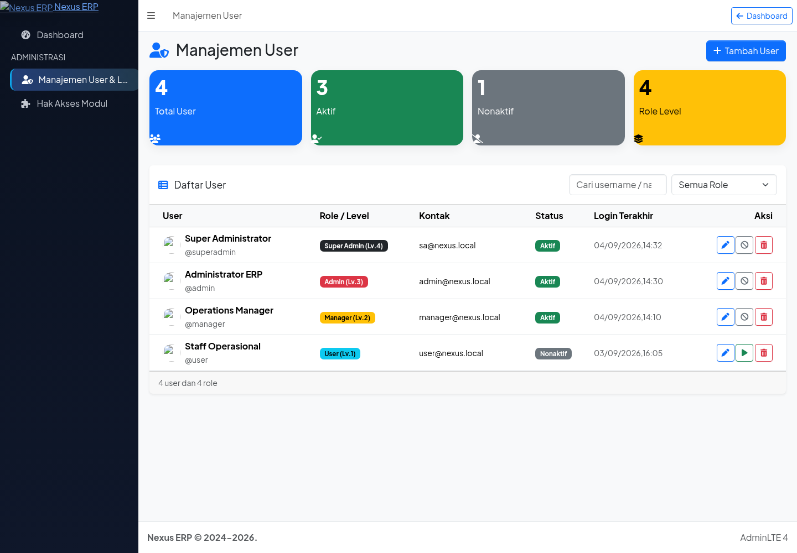

# Nexus ERP — AdminLTE 4 + Node.js/Express + MySQL

ERP modular bergaya SAP (10 modul inti) dengan UI **AdminLTE 4** (terbaru),
backend **Node.js/Express**, database **MySQL 8+**, dan **fitur user level**
(role-based access): `user → manager → admin → superadmin`.

## Tampilan Aplikasi (Screenshot)

| Halaman Login | Dashboard Admin | Manajemen User |
|---------------|------------------|---------------------|
|  |  |  |

> Screenshot dirender real via headless Chromium dari file preview statis AdminLTE 4
> dengan data contoh: `docs/preview-login.html`, `docs/preview-dashboard.html`, `docs/preview-users.html`.

---

## Fitur Utama

- **Login form** AdminLTE 4 (HTML5 validation, show/hide password, alert error)
- **User level / role-based access**:
  - `superadmin` (level 4): full + kelola user/role
  - `admin` (level 3): full modul + kelola user (non-superadmin)
  - `manager` (level 2): modul operasional
  - `user` (level 1): view/entry terbatas per modul
- **Control akses per modul** (`module_access`: view/create/edit/delete per role)
- **Integrasi transaksi lintas modul (Single Source of Truth)**:
  - **Goods Issue (SD)** → kurangi stok `inventory_stock` (MM) + posting
    `journal_entries` FI (Debit COGS / Kredit Inventory)
  - **Goods Receipt (MM)** → tambah stok `inventory_stock` + `stock_ledger`
    (WM) + posting jurnal FI **(Debit: Inventory, Kredit: GR/IR Clearing)**
  - **MRP (PP)** → baca stok MM + demand SD/PP → generate draft
    Purchase Requisition (MM) bila stok kurang

## Struktur Proyek

```
server.js                        # Entry Express: session, static, routes, error handler
package.json
config/db.js                    # MySQL connection pool (mysql2)
config/session.js
middleware/auth.js              # requireAuth, requireLevel, requireModule, loadModuleAccess
routes/auth.routes.js           # GET/POST /login, /logout, /api/auth/me
routes/dashboard.routes.js      # /, /modules/:code, /admin/users (render HTML server-side)
routes/api/mm.routes.js         # API: POST /api/mm/goods-receipts (controller)
services/goodsReceipt.service.js # Service GR atomik: MM + WM + FI dalam 1 transaksi
services/mrp.pseudocode.md     # Pseudocode mesin MRP (PP)
database/schema.sql             # DDL auth: roles, users, modules, module_access, login_logs
database/schema_mm_sd_fi.sql   # DDL operasional: SD SO/Delivery/GI + MM Inventory/PR/PO/GR + FI GL
public/login.html               # Form login AdminLTE 4
public/modules/fi-co.html      # Contoh halaman modul
scripts/setup.js               # Seed user default (bcrypt hash)
```

## Setup & Menjalankan

### 1. Prasyarat

- Node.js >=aten18
- MySQL >=aten8

### 2. Database

```bash
# Buat database lalu import schema auth + schema operasional+
mysql -u root -p -e "CREATE DATABASE nexus_erp CHARACTER SET utf8mb4 COLLATE utf8mb4_unicode_ci;"
mysql -u root -p nexus_erp < database/schema.sql
mysql -u root -p nexus_erp < database/schema_mm_sd_fi.sql
```

### . Konfigurasi & Install

```bash
cp .env.example .env
#  isi DB_USER/DB_PASSWORD/DB_NAME + SESSION_SECRET
npm install
```

### . Seed user default

```bash
node scripts/setup.js
```

| Username     | Password      | Role        |
|---------------|---------------|------------|
| `superadmin`  | `password123`  | Super Admin |
| `admin`        | `password123`  | Admin       |
| `manager`      | `password123`  | Manager     |
| `user`         | `password123`  | User        |

> Ganti password segera setelah login pertama.

### 5. Jalankan

```bash
npm start        # http://localhost:3000
npm run dev     # mode watch
```

---

## Skema Database (Fokus Integrasi SD → MM → FI saat Goods Issue)

`database/schema_mm_sd_fi.sql` memodelkan alur **automated document flow**:

```
sales_orders ──< sales_order_items
      │
      ▼
deliveries ──< delivery_items
      │
      ▼
goods_issues (delivery_id UNIQUE → 1 Delivery =max 1 GI)
      │
      ├──► goods_issue_items (material_id, storage_location_id, quantity,, unit_cost)
      │         └──► inventory_stock (UPDATE quantity -= qty)   ← MM
      │         └──► stock_ledger (INSERT movement_type='GI')      ← WM
      │
      └──► journal_entries (reference_doc_type='GOODS_ISSUE',
      │                        reference_doc_id=goods_issues.id)    ← FI
              └──► journal_entry_lines (Debit: COGS, Kredit: Inventory)
```

**Foreign key kunci**:

- `goods_issues.delivery_id` `UNIQUE` + `FK → deliveries.id` (ID Goods Issue
  terikat dgn ID Delivery; 1 delivery = 1 GI)
- `goods_issues.journal_entry_id` `FK → journal_entries.id` (GI otomatis
  memicu pembuatan ID Journal Entry)
- `goods_issue_items.material_id` → `materials.id`; `storage_location_id`
  → `storage_locations.id` (stok MM/WM ditarik dari master yang sama)

## API Backend: Goods Receipt (MM → WM → FI

**Endpoint**: `POST /api/mm/goods-receipts` (auth: `requireAuth` + `requireAdmin`)

**Body contoh**:

```json
{
  "gr_number": "GR-2025-000001",
  "purchase_order_id": 10,
  "vendor_id": 2,
  "posting_date": "2025-06-01",
  "company_code": "1000",
  "items": [
    {
      "material_id": 2,
      "storage_location_id": 2,
      "quantity": 120,
      "unit_price": 25000,
      "gl_inventory_account_id": 2,
      "gl_gr_ir_clearing_account_id": 3
    }
  ]
}
```

**Apa yang terjadi otomatis** (dalam **satu transaksi MySQL atomik**):

1. Insert `goods_receipts` + `goods_receipt_items` (MM)
2. **Upsert** `inventory_stock.quantity += qty` + insert `stock_ledger`
   (`movement_type='GR'`) → **stok WM bertambah**
3. Generate nomor jurnal + insert `journal_entries`
   (`reference_doc_type='GOODS_RECEIPT'`) + `journal_entry_lines`:
   - **Debit** `gl_inventory_account_id` (Inventory)
   - **Kredit** `gl_gr_ir_clearing_account_id` (GR/IR Clearing)
4. Tautkan `goods_receipts.journal_entry_id` → jurnal tsb..
5. Jika gagal di mana pun → **rollback seluruh transaksi** (stok & jurnal
   selalu konsisten; idempotent via `UNIQUE(gr_number)`).

**Response**:

```json
{
  "success": true,
  "message": "Goods Receipt berhasil diposting — stok WM ditambah dan jurnal FI dibuat",
  "data": { "goodsReceiptId": 11, "journalEntryId": 57, "stockUpdated": 1 }
}
```

**GET**: `GET /api/mm/goods-receipts/:id` (header + item + stock ledger + jurnal\).

---

## API Backend: Manajemen User (Modul User)

**Base URL**: `/api/users` — auth: `requireAuth` + `requireAdmin` (level >=3).

| Method | Endpoint | Deskripsi |
|--------|----------|-----------|
| GET | `/api/users` | Daftar user (filter: `?q=`, `?role=`, `?status=`) |
| GET | `/api/users/roles` | Referensi role & level |
| POST | `/api/users` | Buat user baru (bcrypt hash; hanya role <= level anda) |
| PATCH | `/api/users/:id` | Update profil / ganti password |
| PATCH | `/api/users/:id/toggle` | Aktif / nonaktifkan user |
| DELETE | `/api/users/:id` | Nonaktifkan (soft delete) |

**Aturan keamanan level**:
- User hanya bisa membuat/mengubah role dengan **level lebih rendah atau sama** dengan level-nya.
- Tidak bisa menonaktifkan / menghapus **akun sendiri**.
- Password selalu di-hash `bcrypt` (cost 12)).

**Halaman UI**: `GET /admin/users` — AdminLTE 4 interaktif: tabel user, pencarian, filter role/status, stat cards (total/aktif/nonaktif/role), modal tambah/edit, toggle status, soft delete, toast notifikasi.

---

## Algoritma MRP (Modul PP)

Implementasi logika terdapat di `services/mrp.pseudocode.md`. Ringkasannya:

```
gross_requirements = demand SD (SO terbuka)) + demand PP (BOM/Production Order)
available             = on-hand stock (MM) + planned PO receipts + WIP - safety stock
net_requirements       = MAX(0,, gross - available)

if net > 0 per material:
    draft Purchase Requisition (MM) dikelompokkan per vendor,
    status = 'DRAFT', source = 'MRP'
```

Contoh skenario:

| Material | Stok | SO Demands | PO Planned | Safety | Net (dibeli) |
|----------|-------|------------|------------|--------|----------------|
| MAT-1000 | 500 |  ִ800 |  ִ200 |  ִ50 |  ִ150 (PR dibuat)|

> Run MRP dijadwalkan via cron harian; draft PR dapat direview
> sebelum di-release menjadi PO (guna hindari pembelian ganda).)